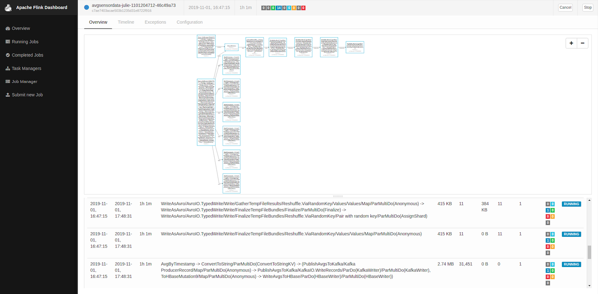

# Cereal Factory Product Humidity Monitoring

## Introduction

This is a data engineering project based on the Hadoop Ecosystem, utilizing Kafka, Beam running on Flink, and Spark and HBase running on a Hadoop cluster. The raw data was sourced from [Schneider Electric Exchange](https://shop.exchange.se.com/home), under the ["Food & beverage drying process"](https://shop.exchange.se.com/apps/39065/food-beverage-drying-process#!overview). The data was collected to monitor and control the moisture level of the product in a breakfast cereal production line. The oven was operated with a collection of sensors that reported measurements every minute while the product humidity data was sampled manually in a lab at irregular times. The data span from 5/21/2014 to 6/11/2014. 

There are three problems that this project aims to solve:

1. Batch load all data collected on a daily basis for data analysts or data scientists to perform analysis in the future.
1. Perform daily batch analysis on sensor data in relations to product humidity measurement.
1. Calculate the running average of all sensor data for real time monitoring.

## Table of Contents

1. [Architecture](#architecture)
1. [Data Simulation](#data-simulation)
1. [HBase Schema Design](#hbase-schema-design)
1. [Data Pipeline](#data-pipeline)
1. [Results](#results)
1. [How To Run Locally](#how-to-run-locally)
1. [Further Improvements](#further-improvements)
1. [Licensing](#licensing)

## Architecture

<p align="center"></img></p>

- Ingestion Layer (Kafka):

  - In a realistic scenario, the sensors to Kafka architecture would look something like this:
       <p align="center"><font size="-1">
    </br>
          <i>Source: <a href="https://www.slideshare.net/ConfluentInc/processing-iot-data-from-end-to-end-with-mqtt-and-apache-kafka">"Processing IoT Data from End to End with MQTT and Apache Kafka"</a> by Kai Waehner, Confluent</i></font></p>
  - Since the original data is a historical data of the cereal production line, a python script was used to read the original raw csv file, split the table into two, one for sensor data and other for lab data, and were published to two separate topics, "sensor" and "lab". The python script was intended to simulate a scenario where the sensor data is reported from the sensors at the oven and passed to Kafka through the architecture as explained above, and the lab data is reported manually at the lab through a UI that publishes to Kafka directly.

- Batch Layer (Apache Beam/Flink Runner, HDFS, Apache Spark): The messages published from the ingestion layer were read with the Apache Beam's KafkaIO, then the data was split into two routes. 
  1. The sensor data and lab data were merged into one PCollection and translated into Avro files, creating one file per day. These avro files were saved on HDFS for Apache Spark to ingest. With Spark, the data was split based on timestamps of when the humidity measurements were reported. Then, the average values of sensor data before each measurement and after the last measurement of each were calculated. 
  1. The sensor data and lab data remained separate and were translated to HBase viable format and inserted into the HBase tables for further querying and analyses.

- Speed Layer (Apache Beam/Flink Runner): On top of ingesting the data using KafkaIO with the batch layer, the real time analysis of running average of all meter readings was conducted. The results were both stored in HBase and published to a separate topic, "averages", on Kafka for the Dashboard web interface to consume from.

- Serving Layer (Apache HBase): HBase ultimately stores three main tables: "runningAvgAnalysis", "currentConditions", and "batchHumidityAnalysis". The table schema is optimized for quick access for future queries or further analyses. The schema design is discussed further in [HBase Schema Design](#hbase-schema-design)

## Data Simulation

### Structure of the Original Data

As seen on the [original csv](./data/food-beverage-drying-process.csv) exported from [Schneider Electric Exchange](https://shop.exchange.se.com/home), the original format of the csv was:

| datetime | productHumidity | processIsOn | inputTemperatureProduct | waterFlowProcess | intensityFanProcess | waterTemperatureProcess| temperatureProcess1 | temperatureProcess2 |
| -------- | ----------- | --------------- | -------------- | --------------- | --- | --------------- | -------------- | ------ |
|2014-06-05T06:01:00-04:00| | 1 | 47.5 | 14.666666666666666 | 50.2 | 38.65 | 29.9 | 60.05 |

The timstamp used the UTC ISO format, productHumidity was empty when the measurement was not taken at that time and was measured in %, processIsOn was represented with 1 for "on" and 0 for "off", all of the temperature values were measured in degrees Celsius, and the unit of measurements for waterFlowProcess and intensityFanProcess were not explained in the source of the file.

### Restructured Raw Data for Simulation

Since the original data was cleaned manually and all of the data were gathered into a single table prior to being published on the online library, I wanted to adjust the schema to something more realistic in a scenario where the sensor data were gathered to a single message by the IoT Gateway, while the lab data that was manually reported was separate from the sensor data. Example schema of sensor data and lab data are as shown:

| datetime                  | processIsOn | inputTemperatureProduct | waterFlowProcess | intensityFanProcess | waterTemperatureProcess| temperatureProcess1 | temperatureProcess2 |
| -------- | ----------- | --------------- | -------------- | --------------- | --- | --------------- | -------------- |
|2014-06-05T06:01:00-04:00| 1 | 47.5 | 14.666666666666666 | 50.2 | 38.65 | 29.9 | 60.05 |

| datetime                  | productHumidity |
| -------------------------- | ----------- |
| 2014-05-30T04:10:00-04:00 | 7.805    |

### SpeedFactor

When running the `send_meter_data.py` to lauch the data publishing simulation to Kafka, the user must provide the `speedFactor`. The `speedFactor` allows the user to quicken the simulation of data. For example, if the user provides the SpeedFactor of 60, one event row of the original data would be sent per second, quickening the simulation time to be 60 times faster than actual time. More accurately, after the change in the schema from the original raw data, one row of the sensor data would be sent to Kafka per second, but the time between lab data would vary, depending on the report time. To match the original data time increment, the user must provide the SpeedFactor of 1. In the testing environment, I used the speedFactor of 240, meaning one row of sensor data was published roughly in 0.25 second.

### Simulation Time vs. Actual Time

Even though the data was sent to Kafka in relations to the actual time, the datetime values were kept as the original values, rather than recreated at the time of publishing to Kafka. This was for the development environment so that the "currentConditions" and "batchHumidityAnalysis" tables do not receive new rows for the same original data every time the Beam pipeline or Spark application is run for testing. On the other hand, the actual time was used to simulate real time behavior for running averages so that the "runningAvgAnalysis" data is saved in relations to the actual time, and the streaming data page of the Web Dashboard displays the actual time of the values' update.  

## HBase Schema Design

All three tables' row keys start with `001#001`, which represent the factory ID, followed by the oven ID, which would be utilized in a scenario where there are multiple factories/product lines with multiple ovens/other units to keep track of. It is not a good practice to simply use the timestamps at the beginning of the key because it could lead to hotspotting. Of course, with the data used, there's only one factory and one oven, so all entries began with `001#001`, but the amount of data was small enough that HBase could handle the writes easily. 

In a case where only one factory with only one oven is the subject of interest, and the number of sensors is significantly higher with each data recorded at a very rapid rate (in seconds or milliseconds), manual classification of the sensors by assigning each with an id, or automatic salting of data would be a potential solution to avoid hotspotting. 

### "currentConditions" Table
<table>
  <tr>
    <th rowspan="2">Row Key</th>
    <th colspan="4">Column Family: "METER"</th>
  </tr>
  <tr>
    <th>COLUMN: 00</th>
    <th>COLUMN: 01</th>
    <th>...</th>
    <th>COLUMN: 59</th>
  </tr>
  <tr>
    <td>001#001#inputTemperatureProduct#20140521#19</td>
    <td>...</td>
    <td>...</td>
    <td>...</td>
    <td>...</td>
  </tr>
</table>

- Row Key Design: 
  - `[factory ID]#[oven ID]#[measurement Type]#[date from data in YYYYMMDD format]#[hour from data in HH format]`
- It was assumed that the common queries would be on an hourly basis, based on the measurement type, so each HBase row was designed to contain data within a specific hour of a specific date for a certain measurement type (e.g., inputTemperatureProduct, temperatureProcess1, etc.)
- All of the cells within the column family, `"METER"` represents the minute the sensor data was recorded, from 00 to 59. 


The "currentConditions" table contains data as shown through the HBase shell:


### "batchHumidityAnalysis" Table
<table>
  <tr>
    <th rowspan="2">Row Key</th>
    <th colspan="9">Column Family: "METER"</th>
  </tr>
  <tr>
    <th>COLUMN: startTimestamp</th>
    <th>COLUMN: endTimestamp</th>
    <th>COLUMN: productHumidity</th>
    <th>COLUMN: avgWaterFlowProcess</th>
    <th>COLUMN: avgIntensityFanProcess</th>
    <th>COLUMN: avgWaterTemperatureProcess</th>
    <th>COLUMN: avgTemperatureProcess1</th>
    <th>COLUMN: avgTemperatureProcess2</th>
    <th>COLUMN: avginputTemperatureProduct</th>
  </tr>
  <tr>
    <td>001#001#20140521#0454#1058</td>
    <td>2014-05-21T04:54:00-04:00</td>
    <td>2014-05-21T10:58:00-04:00</td>
    <td>...</td>
    <td>...</td>
    <td>...</td>
    <td>...</td>
    <td>...</td>
    <td>...</td>
    <td>...</td>
  </tr>
</table>

- Row Key Design
  - `[factory ID]#[oven ID]#[date from data in YYYYMMDD format]#[start time in HHMM format]#[end time in HHMM format]`
- The `startTimestamp` and `endTimestamp` columns signify the earliest time after the last product humidity measurement and the time of the current product humidity measurement the averages are being calculated for.

The "batchHumidityAnalysis" table contains data as shown through the HBase shell:


### "runningAvgAnalysis" Table
<table>
  <tr>
    <th rowspan="2">Row Key</th>
    <th colspan="6">Column Family: "METER"</th>
  </tr>
  <tr>
    <th>COLUMN: inputTemperatureProduct</th>
    <th>COLUMN: waterFlowProcess</th>
    <th>COLUMN: intensityFanProcess</th>
    <th>COLUMN: waterTemperatureProcess</th>
    <th>COLUMN: temperatureProcess1</th>
    <th>COLUMN: temperatureProcess2</th>
  </tr>
  <tr>
    <td>001#001#201911031349</td>
    <td>...</td>
    <td>...</td>
    <td>...</td>
    <td>...</td>
    <td>...</td>
    <td>...</td>
  </tr>
</table>

- Row Key Design
  - `[factory ID]#[oven ID]#[actual time in yyyyMMddHHmm format]`
- Unlike the aforementioned row keys of `"currentConditions"` and `"batchHumidityAnalysis"`, the row key of this table uses the actual time the running averages were inserted into HBase.
- The datetime used for rowkey only shows the minute, and not seconds, since the running averages are measured with the window size of 1 hour and overlap of 30 minutes.

Typing the HBase shell command:


Provides a result as such:


## Data Pipeline


The Beam Pipeline diagram above provides the step by step view of how the data was ingested, aggregated, and loaded, or stream inserted. Starting from the top, the data was read and ingested from Kafka. Then, the pipeline was branched to the stream (on the left), and batch (on the right) processing. As indicated on the diagram, the stream pipeline is marked yellow and the batch pipeline is marked light gray. Within the batch pipeline, the transforms to write as Avro to be read by Spark is indicated in orange and the transforms to send current Conditions to HBase is marked with dark gray.

Here is what Apache Flink displayed while running the job:


### Stream Processing

In the stream processing, the `SlidingWindows` was set, and the general meter readings of each building was aggregated according to the window created to calculate the Mean. The `SlidingWindows` took two arguments -- `size` and `period`. The size indicates how wide the window should be in seconds, and the period indicates for how long (in seconds) the aggregation must be recalculated, leading to overlaps in each window. The window overlaps with `SlidingWindows` is useful for calculating the running averages. A sliding window of 60 seconds with period of 30 seconds would look something like this:

 <p align="center"><font size="-1">
    </br>
          <i>Source: <a href="https://beam.apache.org/documentation/programming-guide/#windowing">"Beam Programming Guide"</i></a></font></p>

The running average values are published to Kafka under the topic, "averages", in a CSV row format for ease of accesss of recent running average values. Kafka keeps the data for 7 days by default, so anyone who is not skilled in Spark or querying HBase could easily retrieve the data from the past 7 days with the `--from-beginning` option, on top of the Web Dashboard consuming the data for display.

### Batch Processing
#### Current Conditions
As shown in the Beam pipeline diagram, the sensor and lab data to be loaded onto HBase did not need to be merged beforehand unlike the PCollection used to create daily Avro files. Also while the processing for Avro required the productHumidity values to be explicitly marked as an empty string while converting to CSV after merging the two PCollections, the processing for HBase simply could be done right after ingesting the two data sources. This was possible partially by the row key design of `"currentConditions"` table separating rows by measurement type. However, even if the `"currentConditions"` table took rows with the similar format as the CSV rows sent to Kafka to the "sensor" topic, the PCollections would not have had to be merged. This is due to the fundamental way HBase stores its data. Unlike a standard RBDMS, which requires an explicit value be present for every row, HBase is NoSQL and allows the row to be inserted with empty columns. Of course, in RBDMS, you could insert `NULL`, but `NULL` actually signifies that the actual value is not present. In a streaming case as this, data arrives at different times, and for data that arrives outside its time window, it is a better option to leave the cell empty, rather than fill it with a value that takes up memory.

#### Daily Aggregate Analysis
The sensor data and lab data were merged into one PCollection and translated into Avro files, creating one file per day. These avro files were saved on HDFS for Apache Spark to ingest. Unfortunately, there was an issue with Beam's AvroIO not being able to recognize the HDFS file scheme, and the files had to be copied from local to HDFS using the script, [`cleanMoveAvro.sh`](./avroCleanup/cleanMoveAvro.sh). Since HDFS cannot comprehend file names with `:`, the script called the python script, [`cleanMoveAvro.py`](./avroCleanup/cleanMoveAvro.py), which converted all colons to underscores before transferring the files to HDFS.

It was assumed that the data from the previous day would be analyzed with Spark every day. The spark application first reads and saves the Avro file as a DataFrame, extracts datetime values of when the product humidity values were measured, and the DataFrame is manually partitioned according to the datetimes extracted. For example, if the DataFrame contains data from 5/21/14 at 12:00AM to 5/21/14 at 11:59PM, and the datetimes extracted are 3:00AM, 12:00PM, and 10:00PM on 5/21/14, the three DataFrames to aggregate would be data from 12:00AM to 3:00AM, 3:01AM to 12:00PM, and 12:01PM to 10:00PM on 5/21/14. The data after 10:00PM would be discarded under the assumption that the next humidity measurement in the lab would not occur until after a normal work hour for lab technicians or scientists, so the sensor data recorded after the last humidity measurement of the previous day would not impact the humidity of the product sample from the morning of the next day as much. After calculating the averages of all sensor data per each partitioned DataFrame, they are stored in HBase in the `"batchHumidityAnalysis"` along with their corresponding product humidity values.

## Results


Current/index page displays the streaming data of current sensor data as well as their running averages. The graphs at the bottom of the page display the running average values from the past 24 hours of the current time. The demo was produced with the `speedFactor` of 240, so the data from the "past 24 hours" had only 12 data points due to the HBase schema design of saving data by minute, not seconds.


Batch page displays the average sensor data between product humidity measurements. Each humidity measurement has corresponding average data values. The graphs display the averages from the past week until yesterday.


## How To Run Locally
### Technologies and Versions Used
#### Data Technologies
- Apache Hadoop (3.2.1)
- Apache Spark/PySpark (2.4.4) 
- Apache HBase (1.4.11)
- Apache Flink (1.8.2)
- Apache Beam (2.16.0)
- Apache Kafka (2.3.0)

#### Languages
- Java SE 8 (JDK 8)
- Python3.7 (3.7.4)
  - Flask (1.1.1)
  - HappyBase (1.2.0)
  - kafka-python (1.4.7)
  - python-dateutil (2.6.1)

***Hadoop, HBase, and Flink were all operated under the pseudo distributed mode, and Kafka and Flask app were run locally.***

### Breakdown of Files and Their Purpose
Here is the file structure of this entire project (excluded misc. files):
```
/cereal_humidity
  |__ /avroCleanup
      |-- cleanMoveAvro.py
      |-- cleanMoveAvro.sh
  |__ /data
      |__ /processed_data
      |-- cleanUpCSV.py
      |-- food-beverage-drying-process.csv
      |-- processData.sh
  |__ /flaskUI
       |__ /app
           |__ /static
               |-- batch.js
               |-- current.js
           |__ /templates
               |__ /pages
                   |-- batch.html
               |-- index.html
           |-- __init__.py
           |-- views.py 
       |-- config.py
       |-- requirements.txt
       |-- run.py
  |__ /jj-flinkbeam
      |__ /src
          |__ /main/java/jj/flinkbeam
              |-- AvroToLog.java
              |-- MainPipeline.java
          |__ /test
      |__ /target
      |-- avroSchema.avsc
      |-- pom.xml
  |__ /kafka
      |-- consumerAvgs.sh
      |-- consumerLab.sh
      |-- consumerSensor.sh
      |-- producer.sh
      |-- send_sensor_data.py
      |-- startKafka.sh
  |__ /py-spark
      |-- CerealHumidity.py
      |-- MultipleBatchAnalysis.py
      |-- sparkSubmitCerealHumidity.sh
      |-- sparkSubmitMultipleBatchAnalysis.sh
```

#### Processing Raw Data
```
|__ /data
    |__ /processed_data
    |-- cleanUpCSV.py
    |-- food-beverage-drying-process.csv
    |-- processData.sh
```
The original data CSV file can be found in this directory, `food-beverage-drying-process.csv`. The shell script `processData.sh` runs `cleanUpCSV.py`, which cleans the raw data. The original data is not in chronological order and is delimited by ";". The `cleanUpCSV.py` produces the `/processed_data` folder with the CSV file to be used to send to Kafka.

#### Running the Beam Pipeline on Flink
```
|__ /jj-flinkbeam
    |__ /src
        |__ /main/java/jj/flinkbeam
            |-- AvroToLog.java
            |-- MainPipeline.java
        |__ /test
    |__ /target
    |-- avroSchema.avsc
    |-- pom.xml
```
The Beam pipepline is written in Java, with the help of mvn for package management. To run the pipeline on Flink locally, run this command in a shell while inside the `jj-flinkbeam` directory:
```
mvn clean package exec:java -Dexec.mainClass=jj.flinkbeam.MainPipeline \
    -Pflink-runner \
    -Dexec.args="--runner=FlinkRunner \
      --output=/tmp/kafkaAvro- \
      --flinkMaster=localhost \
      --filesToStage=target/jj-flinkbeam-bundled-1.0-SNAPSHOT.jar" \
    -Djava.util.logging.config.file=src/main/resources/logging.properties
```
The `--output` from the command signifies the location of the Avro files to be written to in the local file system.

#### Launching Kafka, Producing, and Consuming Data
```
|__ /kafka
    |-- consumerAvgs.sh
    |-- consumerLab.sh
    |-- consumerSensor.sh
    |-- producer.sh
    |-- send_sensor_data.py
    |-- startKafka.sh
```
Before producing the data to Kafka, you must start the Kafka server. This can be done with `startKafka.sh`. Then, run `producer.sh`, which runs `send_sensor_data.py`. This python script reads the processed CSV row by row, and simulates the streaming data publishing to Kafka, depending on the `speedFactor` provided by the user. The `speedFactor` can be changed in `producer.sh`. The default setup used for development environment was 240. After the data stream begins, you can check whether the data is properly published by running `consumerSensor.sh` for sensor data and `consumerLab.sh` for lab data. If the Flink job is running, you could check the running averages being published to Kafka with `consumerAvgs.sh`. All of the consumer scripts uses `--from-beginning`, so if you wish to data published only after the consumer is started, delete the parameter.

**Keep in mind that all of the scripts are under the assumption that you installed Kafka locally in the same directory as my environment, and are running on Ubuntu/Debian. If different, make sure to change the script to adjust to your environment setup.**

#### Launching the Web Interface
```
|__ /flaskUI
     |__ /app
         |__ /static
             |-- batch.js
             |-- current.js
         |__ /templates
             |__ /pages
                 |-- batch.html
             |-- index.html
         |-- __init__.py
         |-- views.py 
     |-- config.py
     |-- requirements.txt
     |-- run.py
```
Before running the server, make sure to have all of the required Python libraries, noted in `requirements.txt` installed. Then, you can start the server by:
```
python run.py
```
Once the server starts, you can view the UI on `localhost:3000`

#### Bulk Clean and Move Avro to HDFS
```
|__ /avroCleanup
    |-- cleanMoveAvro.py
    |-- cleanMoveAvro.sh
```
As mentioned before, there was an issue with `AvroIO` not recognizing the HDFS file scheme in attempt to write the Avro file directly to HDFS. The current project writes the Avro file to the local file system, to the location indicated in the Maven command to run the Beam Pipeline. For testing, I used the `cleanMoveAvro.sh` script that called `cleanMoveAvro.py` on all Avro files produced and put them in HDFS. Before copying the files to HDFS, the directory must be created. The path I used was `/user/hadoop/cereal/data/`. If you wish to use a different setup, make sure to be consisten throughout. 

In a case of one file, you can simply rename the file manually to get rid of the colons (since HDFS cannot accept filenames with colons), and run:
```
[hadoop home dir]/bin/hdfs dfs -put [Avro file full path] [HDFS directory to add the files to]
```

#### Perform Daily Batch Analysis
```
|__ /py-spark
    |-- CerealHumidity.py
    |-- MultipleBatchAnalysis.py
    |-- sparkSubmitCerealHumidity.sh
    |-- sparkSubmitMultipleBatchAnalysis.sh
```


## Further Improvements

### Improvements for Optimization
- Split the Beam pipeline to separate stream and batch jobs.
  - In this project, the stream and batch pipelines are independent, but were combined into one job for the ease of testing. It is not good practice to merge all jobs into one in practice if the two pipelines are independent of each other. If one part of the job fails, it will halt the entire job until the problem is fixed, or could be restarted.
- Eliminate repeated filtering of sensor data for inserting them into the `"currentConditions"` table in HBase.
  - Instead of looping through the columns to perform the PTransform `"ToHBaseMutation"`, followed by `"WriteCurrentConditionsToHBase"`, of the sensor data to form multiple `Put()` objects, produce a chain of `.addColumn()` to a single `Put()`. Currently, the code reads through the same PCollection multiple times to filter out the values of each column.
  - The PCollection fed into `"ToHBaseMutation"` is in a form of `KV<String, String>`, with datetime as key and sensor values delimited by "," as value, so it should be a quick fix to loop through the values within the PTransform to create the `Put()` with multiple `.addColumn()`.
- Get rid of Avro and read from HBase.
  - Currently, it is obvious that the work done to produce both Avro and HBase rows is repetitive and inefficient. This was a quick workaround to the fact that reading from HBase to Spark DataFrame using PySpark did not have a feature to scan for specific rows of the HBase table before producing the DataFrame. The examples provided only seemed to talk about reading the entire table to DataFrame.
  - For a specific use case of retrieving HBase data from start prefix row to end prefix row is a common problem solved using Java. A quick code example to solve the problem:
    ```
    val conf = HBaseConfiguration.create()
    conf.set(TableInputFormat.INPUT_TABLE, "currentConditions")
    val startRow = "001#001#inputTemperatureProduct#20140521"
    val endRow = "001#001#inputTemperatureProduct#20140522#00"
    conf.set(TableInputFormat.SCAN_ROW_START, startRow)
    conf.set(TableInputFormat.SCAN_ROW_STOP, endRow)
    sc.newAPIHadoopRDD(conf, classOf[TableInputFormat], classOf[ImmutableBytesWritable], classOf[Result])
    ```
  - This would make the Spark application even more efficient since the productHumidity data is already saved as a separate row and the datetime values can be extracted to partition the sensor values for calculating the averages. This also allows a case where the product humidity gets measured in the middle of the night and the values be analyzed without requiring compromise with efficiency; with using Avro, this would require reading two daily files.
- Improve the accuracy of running averages using watermark triggering and time window with more frequent overlaps.
  - Currently, the project calculates the running averages based on hourly window with 30 minute overlap. This is a fair setup for the sliding windows if the averages do not have to be highly accurate, just providing approximations, and don't need to be updated so frequently. However, in a scenario where the running average values must be updated frequently and the analysts seek for values reflecting more on the sensor data at that instant rather than a wide timeframe, it would be better to narrow the window size and increase the frequency of the overlap. 
  - Also, especially in a scenario with sensor data being produced in seconds or milliseconds, latency would be a problem to achieving accuracy of the average values. If the running averages are crucial data to be analyzed later and require high accuracy, it would be better to add triggering based on watermarks to account for data that arrives late and recalcualte the values.

### Miscellaneous Improvements
- Add Apache Phoenix on top of HBase for easy SQL querying for analysts. Apache Phoenix is a relational database engine that uses HBase as its backing store, providing a programmatic ANSI SQL interface. As of the system built so far, there is no easy way to query the data without the use of Spark. (HBase shell shows the bytes data, so the actual data is not readable) 
- Add security to the Web Dashboard for limited access of data.


## Licensing

This project uses the [Apache License 2.0](LICENSE)
